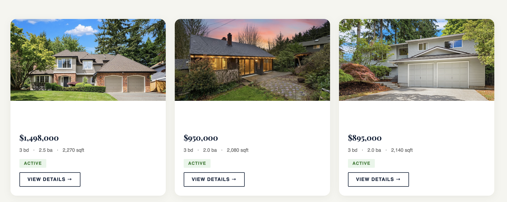
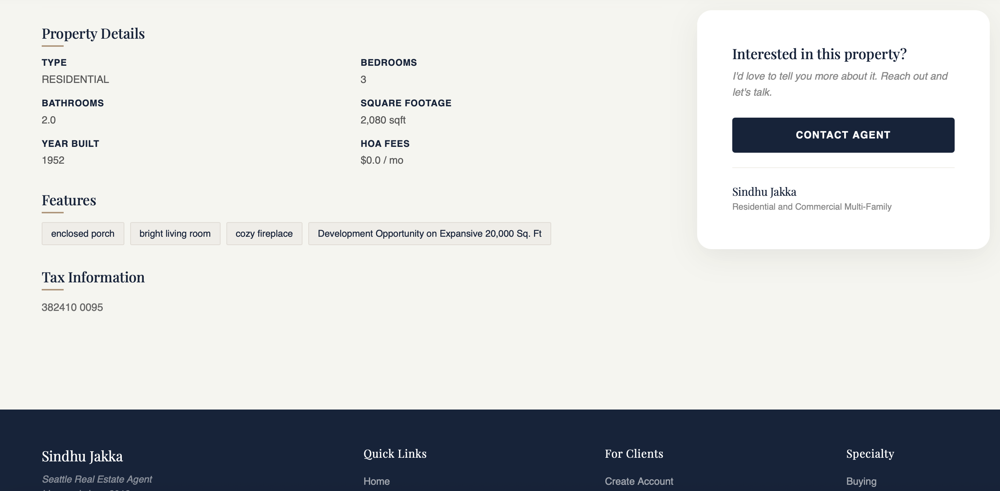
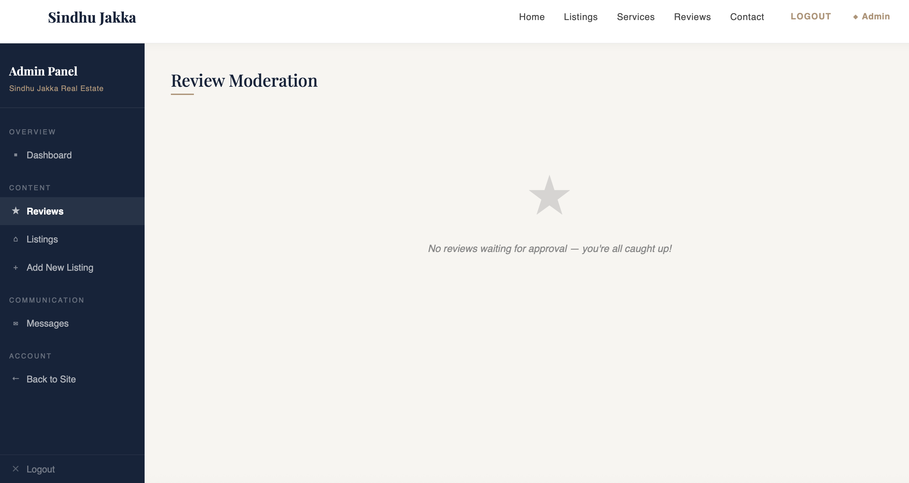

# Real Estate — Full Stack Web Application

A production-ready real estate web application built with Java Spring Boot, featuring property listings, admin management, client reviews and cloud photo storage.

🌐 **Live Demo:** [pacifichomes.up.railway.app](https://real-estate-web-app-production-5985.up.railway.app)

---

## Features

### Public
- Browse property listings with photo gallery and lightbox
- View detailed property information with left/right photo navigation
- Read client reviews with star ratings
- Contact agent directly from listing page
- Submit reviews (requires account)
- Anonymous contact form with name and email

### Admin Panel
- Add, edit and delete property listings
- Upload listing photos to Cloudinary cloud storage
- Moderate and approve client reviews
- Manage client inquiries with Mark Contacted and Reply actions
- Role-based access control (Admin vs Client)

### Authentication
- Secure login with Spring Security
- Client registration and login
- Password reset via Gmail SMTP email
- Role-based navigation (Admin/Client/Anonymous)

---

## Tech Stack

### Backend
- Java 21
- Spring Boot 4.0
- Spring Security (role-based authentication)
- Spring MVC
- JPA / Hibernate
- Maven

### Frontend
- Thymeleaf (server-side templating)
- Bootstrap 5.3
- JavaScript
- AOS (Animate On Scroll)
- Custom CSS with Playfair Display and Dancing Script fonts

### Database
- MySQL
- Railway MySQL (production)

### Cloud & Integrations
- Cloudinary (photo storage and CDN)
- Google Places API (live Google reviews)
- Gmail SMTP (password reset emails)

### Deployment
- Railway (hosting)
- GitHub (version control)

---

## Screenshots

### Home Page


### Listings Page


### Listing Details


### Admin Panel


---

## Getting Started

### Prerequisites
- Java 21
- MySQL 8.0
- Maven
- Cloudinary account (free)

### Setup

**1. Clone the repository:**
```bash
git clone https://github.com/Sahanatk/real-estate-web-app.git
cd real-estate-web-app
```

**2. Create MySQL database:**
```sql
CREATE DATABASE dreamhomes;
```

**3. Configure properties:**
```bash
cp src/main/resources/application-example.properties src/main/resources/application-local.properties
```

Edit `application-local.properties` with your values:
```properties
spring.datasource.url=jdbc:mysql://localhost:3306/dreamhomes
spring.datasource.username=YOUR_DB_USERNAME
spring.datasource.password=YOUR_DB_PASSWORD
admin.username=agent_admin
admin.password=YOUR_ADMIN_PASSWORD
cloudinary.cloud-name=YOUR_CLOUD_NAME
cloudinary.api-key=YOUR_API_KEY
cloudinary.api-secret=YOUR_API_SECRET
```

**4. Run the application:**
```bash
./mvnw spring-boot:run -Dspring-boot.run.profiles=local
```

**5. Visit:**
```
http://localhost:8080
```

**Default admin login:**
- Username: `agent_admin`
- Password: as configured in `application-local.properties`

---

## Project Structure

```
src/
├── main/
│   ├── java/com/example/myOwnRealtorWebsite/
│   │   ├── config/          # Security configuration
│   │   ├── controller/      # MVC controllers
│   │   ├── model/           # JPA entities
│   │   ├── repository/      # Spring Data repositories
│   │   └── service/         # Business logic
│   └── resources/
│       ├── static/
│       │   ├── css/         # Stylesheets
│       │   └── images/      # Static images
│       └── templates/       # Thymeleaf HTML templates
│           └── fragments/   # Reusable layout fragments
```

---

## Environment Variables

| Variable | Description |
|----------|-------------|
| `SPRING_DATASOURCE_URL` | MySQL connection URL |
| `SPRING_DATASOURCE_USERNAME` | MySQL username |
| `SPRING_DATASOURCE_PASSWORD` | MySQL password |
| `ADMIN_USERNAME` | Admin login username |
| `ADMIN_PASSWORD` | Admin login password |
| `CLOUDINARY_CLOUD_NAME` | Cloudinary cloud name |
| `CLOUDINARY_API_KEY` | Cloudinary API key |
| `CLOUDINARY_API_SECRET` | Cloudinary API secret |
| `MAIL_USERNAME` | Gmail address for SMTP |
| `MAIL_PASSWORD` | Gmail App Password |
| `GOOGLE_PLACES_API_KEY` | Google Places API key |
| `GOOGLE_PLACE_ID` | Google Business Place ID |

---

## License

This project was built as a personal portfolio project.